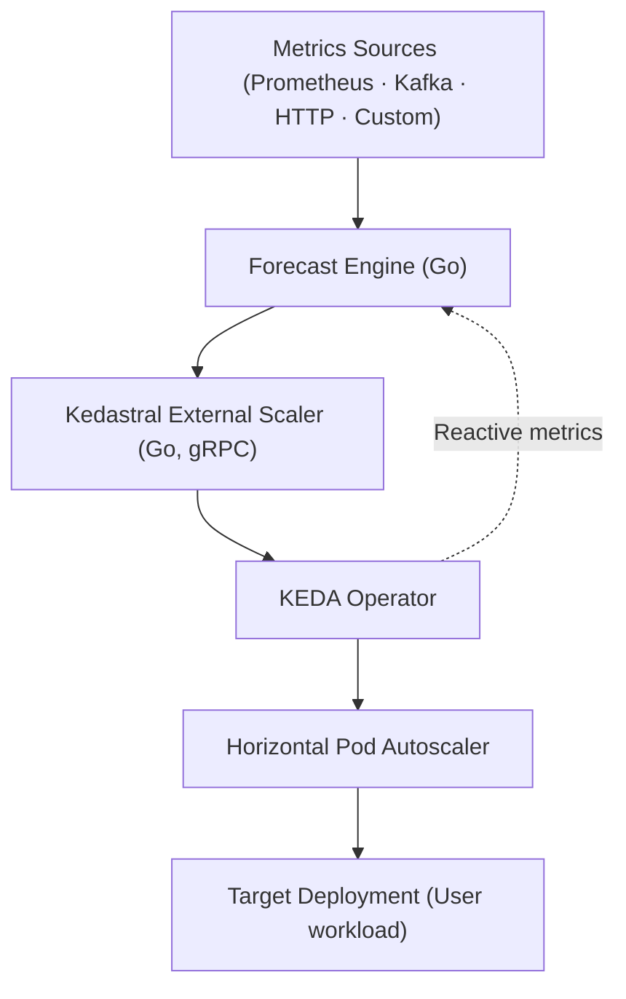

# 📘 README.md — *Kedastral*

> **Kedastral** — *Predict tomorrow's load, scale today.*

[](https://github.com/kedastral/kedastral/releases/latest)
[](https://pkg.go.dev/github.com/kedastral/kedastral)
[](https://goreportcard.com/report/github.com/kedastral/kedastral)
[](https://opensource.org/licenses/Apache-2.0)

---

## 🧭 Overview

**Kedastral** is an open-source, domain-agnostic **predictive autoscaling companion for [KEDA](https://keda.sh/)**, written in **Go**.

It enables Kubernetes workloads to **scale proactively**, not just reactively, by **forecasting future demand** (for example, request rate, queue depth, or events) and translating that forecast into desired replica counts **before** resource metrics like CPU or RPS spike.

Where **KEDA** reacts to what *has already happened*, **Kedastral** predicts *what will happen next* — keeping applications responsive, stable, and cost-efficient during sudden traffic surges.

---

## 🚀 Current Features (v0.1 MVP)

| Feature | Description | Status |
|----------|-------------|--------|
| 🔮 **Predictive scaling** | Forecast short-term demand and set replica counts ahead of time | ✅ Implemented |
| ⚙️ **KEDA-native integration** | Implements the official KEDA **External Scaler** gRPC interface | ✅ Implemented |
| 📈 **Prometheus adapter** | Pull metrics from Prometheus for forecasting | ✅ Implemented |
| 💾 **Storage backends** | In-memory (default) and Redis for HA deployments | ✅ Implemented |
| 🧠 **Baseline forecasting model** | Statistical baseline with quantile-based prediction | ✅ Implemented |
| 📊 **ARIMA forecasting model** | Time-series forecasting for trending/seasonal workloads | ✅ Implemented |
| 🧠 **Built in Go** | Fast, efficient, minimal footprint; deployable as static binaries or containers | ✅ Implemented |
| 🧱 **Extensible interfaces** | Well-defined interfaces for adapters and models | ✅ Implemented |
| 🔐 **Data stays local** | All forecasting and scaling happen *inside* your cluster | ✅ Implemented |
| 📊 **Prometheus metrics** | Exposes metrics for monitoring forecast health | ✅ Implemented |
| 🐳 **Docker support** | Dockerfiles for containerized deployment | ✅ Implemented |
| 🧪 **Comprehensive tests** | 81 unit tests covering core functionality | ✅ Implemented |

### 🔮 Planned Features

- **Declarative CRDs** - Kubernetes-native configuration (`ForecastPolicy`, `DataSource`)
- **Additional adapters** - Kafka, HTTP APIs, and custom data sources
- **Advanced ML models** - Prophet, SARIMA, and custom model support
- **Helm charts** - Easy deployment via Helm
- **Grafana dashboards** - Pre-built dashboards for visualization

---

## 📊 Forecasting Models

Kedastral supports two forecasting models, selectable via the `--model` flag:

### Baseline (Default)
- **Algorithm**: Linear trend + momentum + multi-level seasonality (minute-of-hour + hour-of-day)
- **Training**: Uses historical window to learn seasonal patterns (requires 2-3 pattern repetitions)
- **Best for**: Workloads with recurring patterns (hourly/daily cycles)
- **Pros**: Fast, adaptive blending of trend and seasonality, handles intra-hour and daily patterns
- **Cons**: Needs 2-3 hours of data for optimal accuracy
- **Configuration**: `--model=baseline` (default)

### ARIMA
- **Algorithm**: AutoRegressive Integrated Moving Average (pure Go)
- **Training**: Required (uses historical window)
- **Best for**: Workloads with trends, seasonality, or autocorrelation
- **Pros**: Better accuracy for complex patterns
- **Cons**: Requires training data, slower startup
- **Configuration**: `--model=arima --arima-p=1 --arima-d=1 --arima-q=1`

**Model Comparison**:

| Feature              | Baseline | ARIMA |
|----------------------|----------|-------|
| Training time        | None     | ~15μs per 1K points |
| Prediction time      | <10ms    | <1μs for 30 steps |
| Memory overhead      | ~1MB     | ~5MB |
| Handles trends       | ❌       | ✅    |
| Handles seasonality  | Basic    | ✅    |
| Training data needed | No       | Yes   |
| Recommended for      | Stable workloads | Complex patterns |

**Example usage**:

```bash
# Baseline (default)
./forecaster --workload=my-api --model=baseline

# ARIMA with auto parameters (default: p=1, d=1, q=1)
./forecaster --workload=my-api --model=arima

# ARIMA with custom parameters
./forecaster --workload=my-api --model=arima --arima-p=2 --arima-d=1 --arima-q=2
```

**ARIMA Parameters**:
- **p** (AR order): How many past values to use (1-3 typical)
- **d** (differencing): Trend removal (0=none, 1=linear, 2=quadratic)
- **q** (MA order): How many past errors to use (1-3 typical)
- **Auto (0)**: Defaults to 1 for all parameters (ARIMA(1,1,1))

---

## 💡 Example Use Cases

Kedastral is **domain-neutral**. You can use it for any workload that shows predictable or event-driven traffic patterns:

| Domain | Typical signals | Scaling goal |
|---------|------------------|--------------|
| E-commerce | request rate, promotions, time of day | scale before sales campaigns |
| Video streaming | viewer counts, release schedule | pre-scale for new show launches |
| Banking & fintech | batch job schedules, queue lag | prepare for end-of-month loads |
| IoT ingestion | connected devices count | absorb telemetry spikes gracefully |
| SaaS APIs & gaming | RPS, active sessions, time windows | prevent latency from scaling delays |

---

## 🏗️ Architecture Overview

Kedastral currently consists of **two main components**, both implemented in **Go** for performance and operational simplicity.

### 1. **Forecaster** (`cmd/forecaster`)

- Collects recent metrics from **Prometheus** using configurable queries
- **Warm-start capability**: On startup, queries Prometheus for full historical window (e.g., 3 hours) to immediately start with learned patterns
- Uses a **baseline forecasting model** (trend + momentum + multi-level seasonality) to predict short-term load
- Translates predicted load into **desired replica counts** using a configurable capacity policy
- Stores forecasts in memory and exposes them via HTTP API (`/forecast/current`)
- Exposes Prometheus metrics for monitoring (`/metrics`)
- Health check endpoint (`/healthz`)

### 2. **Scaler** (`cmd/scaler`)

- Implements the [KEDA External Scaler gRPC API](https://keda.sh/docs/latest/concepts/external-scalers/)
- Periodically queries the Forecaster via HTTP to fetch the latest forecast
- Selects appropriate replica count based on configured **lead time** (proactive scaling window)
  - Default: 5 minutes (good for gradual changes)
  - Recommended: 10-15 minutes for workloads with predictable spikes
  - Takes MAX over the lead-time window for proactive scale-up
- Returns **desired replicas** to KEDA via gRPC interface
- Exposes health check and metrics endpoints

The two components form a closed feedback loop:

```
Prometheus → Forecaster → HTTP → Scaler → gRPC → KEDA → HPA → Workload
```

---

### 🧩 Component Diagram (ASCII)

```
┌────────────────────┐
│  Metrics Sources   │
│ (Prometheus, etc.) │
└─────────┬──────────┘
          │
          ▼
┌────────────────────┐
│  Kedastral         │
│  Forecast Engine   │  (Go)
│  • Collects data   │
│  • Forecasts load  │
│  • Outputs replicas│
└─────────┬──────────┘
          │ REST/gRPC
          ▼
┌────────────────────┐
│  Kedastral Scaler  │  (Go, gRPC)
│  • KEDA plugin     │
│  • Reports replicas│
└─────────┬──────────┘
          │
          ▼
┌────────────────────┐
│        KEDA        │
│   (HPA controller) │
└─────────┬──────────┘
          │
          ▼
┌────────────────────┐
│ Target Deployment  │
│   (User workload)  │
└────────────────────┘
```

### 🧭 Mermaid Diagram



---

## 💾 Storage Backends

Kedastral supports two storage backends for forecast snapshots, allowing you to choose between simplicity and high availability:

### In-Memory Storage (Default)
- **Best for**: Single forecaster instance, development, testing
- **Pros**: Zero dependencies, fast, simple setup
- **Cons**: No persistence across restarts, no HA support
- **Configuration**: `--storage=memory` (default)

```bash
# Uses in-memory storage by default
./forecaster --workload=my-api --metric=http_rps
```

### Redis Storage
- **Best for**: Multi-instance forecasters, production HA deployments, persistence
- **Pros**: Shared state across replicas, TTL-based expiration, horizontal scaling
- **Cons**: Requires Redis server, additional network dependency
- **Configuration**: `--storage=redis --redis-addr=HOST:PORT`

```bash
# Using Redis storage
./forecaster --storage=redis \
  --redis-addr=redis:6379 \
  --redis-ttl=1h \
  --workload=my-api \
  --metric=http_rps
```

**Redis Configuration Options:**
- `--storage=redis` - Enable Redis backend
- `--redis-addr=HOST:PORT` - Redis server address (default: localhost:6379)
- `--redis-password=SECRET` - Redis password (optional)
- `--redis-db=N` - Redis database number (default: 0)
- `--redis-ttl=DURATION` - Snapshot TTL (default: 30m)

**Example HA Deployment:**
See [`examples/deployment-redis.yaml`](examples/deployment-redis.yaml) for a complete Kubernetes deployment with:
- Redis for persistent storage
- 2+ forecaster replicas sharing Redis
- Scaler consuming forecasts from HA forecasters

---

## 🧠 How It Works

1. **Data Collection:** Kedastral’s adapters pull short-term metrics and contextual features from your chosen data sources.
2. **Forecasting:** The engine runs a forecasting model to estimate load (RPS, queue length, etc.) for the next few minutes.
3. **Replica Calculation:** Using the configured capacity model, Kedastral computes how many pods will be required to handle that future load.
4. **Integration with KEDA:**
   - The Kedastral External Scaler exposes the forecast as a metric via gRPC.
   - KEDA reads it and updates the Horizontal Pod Autoscaler (HPA).
   - Your workload scales *before* demand arrives.

---

## 🚀 Quick Start

### Building from Source

```bash
# Clone the repository
git clone https://github.com/HatiCode/kedastral.git
cd kedastral

# Build both forecaster and scaler
make build

# Or build individually
make forecaster
make scaler

# Run tests
make test
```

### Running Locally

#### 1. Start the Forecaster

The forecaster generates predictions and exposes them via HTTP:

```bash
./bin/forecaster \
  -workload=my-api \
  -metric=http_rps \
  -prom-url=http://localhost:9090 \
  -prom-query='sum(rate(http_requests_total{service="my-api"}[1m]))' \
  -target-per-pod=100 \
  -headroom=1.2 \
  -min=2 \
  -max=50 \
  -lead-time=5m \
  -log-level=info
```

Check the forecast:
```bash
curl "http://localhost:8081/forecast/current?workload=my-api"
```

#### 2. Start the Scaler

The scaler implements the KEDA External Scaler gRPC interface:

```bash
./bin/scaler \
  -forecaster-url=http://localhost:8081 \
  -lead-time=5m \
  -log-level=info
```

The scaler exposes:
- gRPC on `:50051` for KEDA
- HTTP metrics on `:8082`

#### 3. Configure KEDA

Apply a ScaledObject to connect KEDA to Kedastral:

```yaml
apiVersion: keda.sh/v1alpha1
kind: ScaledObject
metadata:
  name: my-api-scaledobject
spec:
  scaleTargetRef:
    name: my-api
    kind: Deployment
  pollingInterval: 30
  minReplicaCount: 2
  maxReplicaCount: 50
  triggers:
    - type: external
      metadata:
        scalerAddress: kedastral-scaler:50051
        workload: my-api
```

### Deploying to Kubernetes

See the [examples/](./examples/) directory for complete Kubernetes deployment manifests:

- **[examples/deployment.yaml](./examples/deployment.yaml)** - Complete deployment for forecaster and scaler
- **[examples/scaled-object.yaml](./examples/scaled-object.yaml)** - KEDA ScaledObject configuration
- **[examples/README.md](./examples/README.md)** - Detailed usage guide with configuration tables and troubleshooting

Quick deploy:
```bash
kubectl apply -f examples/deployment.yaml
kubectl apply -f examples/scaled-object.yaml
```

---

## 🧰 Current Tech Stack

| Component | Technology | Status |
|------------|-------------|---------|
| Core language | **Go** (≥1.25) | ✅ |
| Forecaster API | REST (HTTP) | ✅ |
| Scaler API | gRPC (KEDA External Scaler protocol) | ✅ |
| Forecast model | Baseline (statistical) | ✅ |
| Metrics adapter | Prometheus | ✅ |
| Storage | In-memory | ✅ |
| Observability | Prometheus metrics | ✅ |
| Testing | Go testing framework (81 tests) | ✅ |
| Deployment | Kubernetes manifests + Dockerfiles | ✅ |

**Planned:** Redis storage, Helm charts, additional adapters (Kafka, HTTP), ML models (Prophet, ARIMA), Grafana dashboards

---

## 🧱 Current Project Structure

```
kedastral/
├─ cmd/
│  ├─ forecaster/          # Forecaster binary and subpackages
│  │  ├─ main.go
│  │  ├─ forecaster.go
│  │  ├─ config/           # Configuration parsing
│  │  ├─ logger/           # Structured logging
│  │  ├─ metrics/          # Prometheus metrics
│  │  └─ router/           # HTTP routes
│  └─ scaler/              # Scaler binary and subpackages
│     ├─ main.go
│     ├─ scaler.go
│     ├─ config/           # Configuration parsing
│     ├─ logger/           # Structured logging
│     ├─ metrics/          # Prometheus metrics
│     └─ router/           # HTTP routes
├─ pkg/
│  ├─ adapters/            # Prometheus adapter
│  ├─ models/              # Baseline forecasting model
│  ├─ capacity/            # Replica calculation logic
│  ├─ features/            # Feature engineering
│  ├─ storage/             # In-memory snapshot storage
│  ├─ httpx/               # HTTP server utilities
│  └─ api/externalscaler/  # KEDA External Scaler protobuf
├─ examples/               # Kubernetes deployment examples
│  ├─ deployment.yaml      # Complete deployment manifests
│  ├─ scaled-object.yaml   # KEDA ScaledObject example
│  └─ README.md            # Detailed usage guide
├─ docs/                   # Design documentation
│  ├─ capacity-planner.md
│  ├─ cli-design.md
│  └─ forecaster-store-interface.md
├─ test/integration/       # Integration tests
├─ Dockerfile.forecaster   # Forecaster container image
├─ Dockerfile.scaler       # Scaler container image
├─ Makefile                # Build automation
└─ LICENSE (Apache-2.0)
```

---

## 🔧 Installation

### Prerequisites

- Go 1.25 or later (for building from source)
- Kubernetes cluster (v1.20+)
- KEDA installed ([installation guide](https://keda.sh/docs/latest/deploy/))
- Prometheus running in the cluster

### From Source

```bash
# Clone and build
git clone https://github.com/HatiCode/kedastral.git
cd kedastral
make build

# Deploy to Kubernetes
kubectl apply -f examples/deployment.yaml
kubectl apply -f examples/scaled-object.yaml
```

### Using Makefile

```bash
make build           # Build both forecaster and scaler
make test            # Run all tests
make test-coverage   # Run tests with coverage report
make clean           # Remove build artifacts
make help            # Show all available targets
```

See the [examples/README.md](./examples/README.md) for detailed deployment instructions and configuration options.

---

## 📚 Documentation

### API Documentation

Full Go package documentation is available at [pkg.go.dev](https://pkg.go.dev/github.com/HatiCode/kedastral):

- **[pkg/adapters](https://pkg.go.dev/github.com/HatiCode/kedastral/pkg/adapters)** - Data source connectors (Prometheus, etc.)
- **[pkg/models](https://pkg.go.dev/github.com/HatiCode/kedastral/pkg/models)** - Forecasting model interfaces and implementations
- **[pkg/capacity](https://pkg.go.dev/github.com/HatiCode/kedastral/pkg/capacity)** - Replica calculation and capacity planning
- **[pkg/storage](https://pkg.go.dev/github.com/HatiCode/kedastral/pkg/storage)** - Forecast snapshot storage backends
- **[pkg/features](https://pkg.go.dev/github.com/HatiCode/kedastral/pkg/features)** - Feature engineering utilities

### View Documentation Locally

```bash
# Install godoc (if not already installed)
go install golang.org/x/tools/cmd/godoc@latest

# Start local documentation server
godoc -http=:6060

# Open in browser
open http://localhost:6060/pkg/github.com/HatiCode/kedastral/
```

---

## 📊 Observability

### Forecaster Metrics

| Metric | Type | Description |
|---------|------|--------------|
| `kedastral_predicted_value` | Gauge | Current predicted metric value (e.g., RPS) |
| `kedastral_desired_replicas` | Gauge | Current desired replica count (without lead-time) |
| `kedastral_forecast_age_seconds` | Gauge | Age of the current forecast in seconds |
| `kedastral_adapter_collect_seconds` | Histogram | Time spent collecting metrics from adapter |
| `kedastral_model_predict_seconds` | Histogram | Time spent predicting forecast |
| `kedastral_capacity_compute_seconds` | Histogram | Time spent computing desired replicas |
| `kedastral_errors_total` | Counter | Total errors by component and reason |

### Scaler Metrics

| Metric | Type | Description |
|---------|------|--------------|
| `kedastral_scaler_desired_replicas_returned` | Gauge | Last replica count returned to KEDA (with lead-time) |
| `kedastral_scaler_forecast_age_seen_seconds` | Gauge | Age of forecast when scaler fetched it |
| `kedastral_scaler_forecast_fetch_duration_seconds` | Histogram | Time spent fetching forecast from forecaster |
| `kedastral_scaler_forecast_fetch_errors_total` | Counter | Total errors fetching forecasts |
| `kedastral_scaler_grpc_request_duration_seconds` | Histogram | KEDA gRPC request duration by method |

---

## 🧩 Extensibility

- **Adapters SDK:** implement your own metric collectors (Go interfaces).
- **Model SDK:** plug in your own forecasting logic.
- **Storage SDK:** replace Redis with your preferred backend.
- **BYOM Mode:** expose an HTTP endpoint returning predictions; Kedastral will use it automatically.

Example interface:
```go
type ForecastModel interface {
    Train(ctx context.Context, data DataFrame) error
    Predict(ctx context.Context, horizon time.Duration) ([]float64, error)
}
```

---

## 🔄 Safety & Fallbacks

- Kedastral can run **hybrid scaling**:
  `effectiveReplicas = max(predicted, reactive)`
  ensuring reactive CPU/RPS-based scaling still applies.
- Built-in clamps: max scale-up/down rate per minute.
- Automatic fallback to KEDA’s default triggers if the forecast is stale or engine is down.

---

## 🧑‍💻 Project Goals

1. Provide a **pluggable, open predictive-scaling layer** for Kubernetes.
2. Empower developers to **forecast and pre-scale workloads** in any industry.
3. Keep **data and control within the user’s cluster**.
4. Remain **KEDA-compatible** and **Go-native**.
5. Grow an **open community** around predictive autoscaling research and practice.

---

## 🌍 License & Governance

- **License:** Apache-2.0
- **Repository:** `github.com/kedastral/kedastral`
- **Maintainers:** community-governed, CNCF-style steering model.
- **Contributions:** welcomed via PRs, adapters, or model integrations.

---

## 🗺️ Roadmap

| Milestone | Key Features | Status |
|------------|---------------|---------|
| **v0.1** (MVP) | Forecaster + Scaler + Prometheus adapter + baseline model + in-memory storage | ✅ **Complete** |
| **v0.2** | Redis storage + additional ML models (Prophet, ARIMA) + Helm chart | 🔄 Planned |
| **v0.3** | CRDs (ForecastPolicy/DataSource) + Grafana dashboards | 🔄 Planned |
| **v0.4** | Additional adapters (Kafka, HTTP) + BYOM plugin + multi-metric ensembles | 🔄 Planned |
| **v1.0** | Kedastral Operator + model registry + full conformance tests + production hardening | 🔄 Planned |

**v0.1 Deliverables (Current):**
- ✅ Forecaster binary with Prometheus integration
- ✅ Scaler binary implementing KEDA External Scaler protocol
- ✅ Baseline statistical forecasting model
- ✅ In-memory forecast storage
- ✅ Capacity planning with configurable policies
- ✅ Prometheus metrics for observability
- ✅ 81 unit tests
- ✅ Docker support
- ✅ Kubernetes deployment examples
- ✅ Comprehensive documentation

---

## ✨ Getting Started

```bash
# 1. Build Kedastral
make build

# 2. Deploy to Kubernetes
kubectl apply -f examples/deployment.yaml
kubectl apply -f examples/scaled-object.yaml

# 3. Monitor forecasts
kubectl logs -l component=forecaster -f
kubectl logs -l component=scaler -f

# 4. Check current forecast
kubectl port-forward svc/kedastral-forecaster 8081:8081
curl "http://localhost:8081/forecast/current?workload=my-api"
```

For detailed instructions, see the [Quick Start](#-quick-start) section above and [examples/README.md](./examples/README.md).

---

## 🧩 Summary for AI Assistants

**Project Name:** Kedastral
**Purpose:** Predictive autoscaling framework for Kubernetes built around KEDA
**Core Language:** Go (≥1.25)
**Current Status:** v0.1 MVP - Production-ready core components
**Primary Components:**
- Forecaster (HTTP API, Prometheus integration, baseline model)
- Scaler (gRPC KEDA External Scaler implementation)

**Key Integrations:** KEDA (External Scaler protocol), Prometheus (metrics source)
**Storage:** In-memory (Redis planned for v0.2)
**Domain Scope:** Domain-agnostic (works for any workload)
**Mission:** Enable proactive scaling decisions in Kubernetes through forecasted metrics
**Deployment:** Kubernetes manifests + Docker containers (Helm planned for v0.2)
**Testing:** 81 unit tests covering core functionality
**Architecture Keywords:** predictive autoscaling, statistical forecasting, Kubernetes, Go, gRPC, KEDA External Scaler, Prometheus, time-series prediction, capacity planning, proactive scaling
