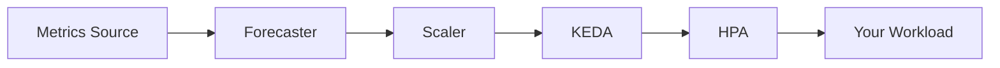

# Kedastral

*Predict tomorrow's load, scale today.*

[](https://github.com/kedastral/kedastral/releases/latest)
[](https://pkg.go.dev/github.com/kedastral/kedastral)
[](https://goreportcard.com/report/github.com/kedastral/kedastral)
[](https://opensource.org/licenses/MIT)

---

## Overview

**Kedastral** is an open-source **predictive autoscaling companion for [KEDA](https://keda.sh/)** that enables Kubernetes workloads to scale proactively based on forecasted demand.

Where **KEDA** reacts to what *has already happened*, **Kedastral** predicts *what will happen next* — keeping applications responsive and cost-efficient during traffic surges.

**Key Features:**
- 🔮 **Predictive scaling** — Forecast demand and scale before spikes arrive
- ⚙️ **KEDA-native** — Implements KEDA External Scaler gRPC protocol
- 📈 **Multiple data sources** — Prometheus, VictoriaMetrics, or any HTTP API
- 🧠 **Multiple models** — Baseline, ARIMA, or BYOM (bring your own model)
- 🔌 **Extensible** — Plug in custom models via HTTP (Prophet, TensorFlow, etc.)
- 💾 **HA-ready** — In-memory or Redis storage for high availability
- 🚀 **Fast & efficient** — Built in Go, minimal footprint
- 🔐 **Data stays local** — All forecasting happens inside your cluster

---

## How It Works


```mermaid
flowchart LR
    A[Metrics Source] --> B[Forecaster]
    B --> C[Scaler]
    C --> D[KEDA]
    D --> E[HPA]
    E --> F[Your Workload]
```

1. **Forecaster** collects metrics from your data source (Prometheus, VictoriaMetrics, HTTP API) and generates predictions
2. **Scaler** fetches forecasts and implements KEDA External Scaler protocol
3. **KEDA** receives desired replicas and updates the HPA
4. **Workload** scales proactively before demand arrives

---

## Quick Start

The recommended path is the **operator**: install the chart with operator mode, then
declare workloads with `ForecastPolicy` / `DataSource` resources. Kedastral runs the
forecast loop and generates the KEDA `ScaledObject` for you.

```bash
# Install (requires KEDA in the cluster)
helm install kedastral deploy/helm/kedastral \
  --set forecaster.operator.enabled=true \
  --set forecaster.operator.scalerAddress=kedastral-scaler:50051

# Declare a data source and a policy
kubectl apply -f deploy/examples/datasource.yaml
kubectl apply -f deploy/examples/forecastpolicy.yaml

# Watch it scale
kubectl get forecastpolicies
kubectl get scaledobjects
```

**See the [Quick Start Guide](docs/QUICKSTART.md) for detailed instructions and the
[Operator Guide](docs/OPERATOR.md) for the CRD reference.**

---

## Use Cases

Kedastral is **domain-agnostic** and works for any workload with predictable patterns:

| Domain | Example Signals | Benefit |
|--------|----------------|---------|
| E-commerce | Request rate, time of day | Pre-scale before sales campaigns |
| Video streaming | Viewer counts, release schedules | Pre-scale for new show launches |
| Banking & fintech | Batch job schedules, queue lag | Handle end-of-month processing |
| IoT ingestion | Device counts, telemetry spikes | Absorb sensor data bursts |
| SaaS APIs | RPS, active sessions | Prevent latency from scaling lag |

---

## Documentation

### Getting Started
- **[Quick Start Guide](docs/QUICKSTART.md)** - Get running in 10 minutes
- **[Operator Guide](docs/OPERATOR.md)** - Declarative setup with ForecastPolicy/DataSource CRDs
- **[Architecture Overview](docs/ARCHITECTURE.md)** - System design and components
- **[Configuration Reference](docs/CONFIGURATION.md)** - All flags and environment variables
- **[Deployment Guide](docs/DEPLOYMENT.md)** - Production deployment patterns

### Components
- **[Forecaster](cmd/forecaster/)** - Prediction engine and capacity planner
- **[Scaler](cmd/scaler/)** - KEDA External Scaler implementation
- **[MCP Server](cmd/mcp-server/)** - AI assistant integration via Model Context Protocol
- **[Backtest](cmd/backtest/)** - Offline model accuracy and capacity evaluation

### Deep Dives
- **[Forecasting Models](docs/models/)** - Baseline, ARIMA, and SARIMA models
- **[BYOM (Bring Your Own Model)](docs/byom.md)** - Integrate custom models via HTTP
- **[Capacity Planning](docs/planner/)** - Replica calculation and tuning
- **[Backtesting](docs/BACKTEST.md)** - Evaluate model accuracy and capacity outcomes offline
- **[Observability](docs/OBSERVABILITY.md)** - Metrics, monitoring, and the [Grafana dashboard](deploy/grafana/)
- **[Security Audit](docs/SECURITY_AUDIT.md)** - Security review results

### Examples
- **[Deployment Examples](examples/)** - Kubernetes manifests and usage guide

---

## Current Status (v0.1)

**Production-ready core components:**

| Component | Status |
|-----------|--------|
| Forecaster (HTTP API) | ✅ |
| Scaler (KEDA External Scaler) | ✅ |
| Prometheus adapter | ✅ |
| VictoriaMetrics adapter | ✅ |
| Generic HTTP adapter | ✅ |
| Baseline forecasting model | ✅ |
| ARIMA forecasting model | ✅ |
| SARIMA forecasting model | ✅ |
| In-memory storage | ✅ |
| Redis storage (HA) | ✅ |
| Quantile forecasting | ✅ |
| Backtesting harness | ✅ |
| Multi-workload support | ✅ |
| TLS support | ✅ |
| Prometheus metrics | ✅ |
| Helm chart | ✅ |
| Grafana dashboard | ✅ |
| CRDs + Operator (ForecastPolicy/DataSource) | ✅ |
| Docker support | ✅ |
| Kubernetes examples | ✅ |
| MCP server (AI assistant integration) | ✅ |

**Planned next:**
- Additional adapters (Kafka, CloudWatch, Datadog)
- BYOM examples beyond Prophet (TensorFlow, etc.)
- Model ensembles and automated model selection

---

## Tech Stack

- **Language:** Go 1.26+
- **Forecaster API:** HTTP/REST
- **Scaler API:** gRPC (KEDA External Scaler protocol)
- **Config:** ForecastPolicy/DataSource CRDs (operator) or flags/env
- **Storage:** In-memory / Redis
- **Metrics:** Prometheus
- **Models:** Baseline (statistical), ARIMA & SARIMA (time-series), BYOM (HTTP)

---

## Installation

### Prerequisites

- Kubernetes cluster (v1.20+)
- KEDA installed ([installation guide](https://keda.sh/docs/latest/deploy/))
- Prometheus running in the cluster

### From Source

```bash
git clone https://github.com/kedastral/kedastral.git
cd kedastral
make build
kubectl apply -f examples/deployment.yaml
kubectl apply -f examples/scaled-object.yaml
```

### Docker

```bash
docker pull kedastral/forecaster:latest
docker pull kedastral/scaler:latest
```

See the [Deployment Guide](docs/DEPLOYMENT.md) for production setup.

---

## Example Configuration

With the **operator**, a workload is a `DataSource` plus a `ForecastPolicy`. The
operator runs the forecast loop and generates the matching KEDA `ScaledObject`:

```yaml
apiVersion: kedastral.io/v1alpha1
kind: DataSource
metadata:
  name: prometheus
spec:
  type: prometheus
  config:
    url: http://prometheus:9090
    query: sum(rate(http_requests_total{service="my-api"}[1m]))
---
apiVersion: kedastral.io/v1alpha1
kind: ForecastPolicy
metadata:
  name: my-api
spec:
  scaleTargetRef:
    name: my-api
  metric: http_rps
  dataSourceRef:
    name: prometheus
  model:
    type: baseline
  capacity:
    targetPerPod: 100.0
    headroom: 1.2
    minReplicas: 2
    maxReplicas: 50
  leadTime: 10m
```

Prefer flags/env instead of CRDs? See the [Configuration Reference](docs/CONFIGURATION.md)
and the [Operator Guide](docs/OPERATOR.md) for both modes.

---

## Observability

Both components expose Prometheus metrics:

**Forecaster Metrics:**
- `kedastral_predicted_value` - Current predicted metric value
- `kedastral_desired_replicas` - Desired replica count
- `kedastral_forecast_age_seconds` - Forecast staleness

**Scaler Metrics:**
- `kedastral_scaler_desired_replicas_returned` - Replicas returned to KEDA
- `kedastral_scaler_forecast_fetch_duration_seconds` - Fetch latency

A ready-to-import Grafana dashboard lives in [`deploy/grafana/`](deploy/grafana/). See
the [Observability Guide](docs/OBSERVABILITY.md) for the complete metrics reference.

---

## Roadmap

| Version | Key Features | Status |
|---------|--------------|--------|
| **v0.1** | Forecaster + Scaler + Baseline/ARIMA + Redis | ✅ Complete |
| **v0.2** | Helm chart + Grafana dashboard + MCP server | ✅ Complete |
| **v0.3** | CRDs + Operator (ForecastPolicy/DataSource) | ✅ Complete |
| **v1.0** | Additional adapters + backtesting + model registry | 🔄 Planned |

---

## Contributing

Contributions are welcome! Please see [CONTRIBUTING.md](CONTRIBUTING.md) for guidelines.

**Ways to contribute:**
- Report bugs and request features via [GitHub Issues](https://github.com/kedastral/kedastral/issues)
- Submit pull requests for bug fixes or new features
- Add new adapters (Kafka, HTTP, custom data sources)
- Add new forecasting models
- Improve documentation

---

## License & Governance

- **License:** MIT
- **Repository:** [github.com/kedastral/kedastral](https://github.com/kedastral/kedastral)
- **Maintainers:** Community-governed, CNCF-style steering model

---

## Support

- **Documentation:** [docs/](docs/)
- **Examples:** [examples/](examples/)
- **Issues:** [GitHub Issues](https://github.com/kedastral/kedastral/issues)
- **Discussions:** [GitHub Discussions](https://github.com/kedastral/kedastral/discussions)

---

## Acknowledgments

Built with:
- [KEDA](https://keda.sh/) - Kubernetes Event-driven Autoscaling
- [Prometheus](https://prometheus.io/) - Monitoring and alerting
- [Go](https://go.dev/) - Programming language

---

**Made with predictive scaling in mind.**
