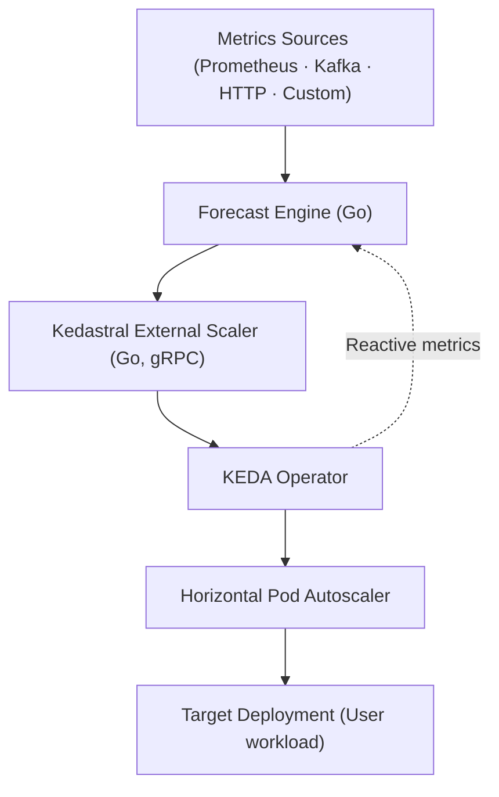

# Architecture Overview

Kedastral implements predictive autoscaling for Kubernetes by forecasting future demand and proactively scaling workloads before traffic arrives.

## System Components

Kedastral consists of **two main components**, both implemented in **Go** for performance and operational simplicity:

### 1. Forecaster (`cmd/forecaster`)

The **Forecast Engine** is responsible for:

- **Data Collection**: Collects recent metrics from **Prometheus** using configurable queries
- **Warm-Start Capability**: On startup, queries Prometheus for full historical window (e.g., 3 hours) to immediately start with learned patterns
- **Forecasting**: Uses statistical or ML models to predict short-term load
- **Capacity Planning**: Translates predicted load into **desired replica counts** using a configurable capacity policy
- **Storage**: Stores forecasts in memory or Redis and exposes them via HTTP API
- **Observability**: Exposes Prometheus metrics (`/metrics`) and health checks (`/healthz`)

**Key Interfaces**:
- HTTP API on port 8081 (default)
- REST endpoint: `GET /forecast/current?workload=<name>`
- Metrics endpoint: `GET /metrics`
- Health check: `GET /healthz`

See [cmd/forecaster/](../cmd/forecaster/) for implementation details.

### 2. Scaler (`cmd/scaler`)

The **KEDA External Scaler** is responsible for:

- **KEDA Integration**: Implements the [KEDA External Scaler gRPC API](https://keda.sh/docs/latest/concepts/external-scalers/)
- **Forecast Consumption**: Periodically queries the Forecaster via HTTP to fetch the latest forecast
- **Lead-Time Logic**: Selects appropriate replica count based on configured **lead time** (proactive scaling window)
  - Default: 5 minutes (good for gradual changes)
  - Recommended: 10-15 minutes for workloads with predictable spikes
  - Takes MAX over the lead-time window for proactive scale-up
- **KEDA Communication**: Returns **desired replicas** to KEDA via gRPC interface
- **Observability**: Exposes health check and metrics endpoints

**Key Interfaces**:
- gRPC on port 50051 (default) for KEDA
- HTTP metrics on port 8082 (default)
- Health check: `GET /healthz`
- Metrics: `GET /metrics`

See [cmd/scaler/](../cmd/scaler/) for implementation details.

## Data Flow

The two components form a closed feedback loop:

```
Prometheus → Forecaster → HTTP → Scaler → gRPC → KEDA → HPA → Workload
```

### Detailed Flow

1. **Metrics Collection**: Forecaster pulls metrics from Prometheus using a configurable query
2. **Feature Engineering**: Raw metrics are transformed into features (trend, seasonality, etc.)
3. **Forecasting**: Model predicts future metric values for the configured horizon
4. **Capacity Planning**: Predicted values are converted to replica counts using the capacity policy
5. **Storage**: Forecast snapshot is stored (memory or Redis)
6. **HTTP Exposure**: Forecaster exposes forecast via REST API
7. **Scaler Fetch**: Scaler periodically fetches the latest forecast
8. **Lead-Time Selection**: Scaler applies lead-time logic to select the appropriate replica count
9. **gRPC Response**: Scaler returns desired replicas to KEDA
10. **HPA Update**: KEDA updates the HorizontalPodAutoscaler
11. **Workload Scaling**: Kubernetes scales the target deployment

## Component Diagrams

### ASCII Diagram

```
┌────────────────────┐
│  Metrics Sources   │
│ (Prometheus, etc.) │
└─────────┬──────────┘
          │
          ▼
┌────────────────────┐
│  Kedastral         │
│  Forecast Engine   │  (Go)
│  • Collects data   │
│  • Forecasts load  │
│  • Outputs replicas│
└─────────┬──────────┘
          │ REST/gRPC
          ▼
┌────────────────────┐
│  Kedastral Scaler  │  (Go, gRPC)
│  • KEDA plugin     │
│  • Reports replicas│
└─────────┬──────────┘
          │
          ▼
┌────────────────────┐
│        KEDA        │
│   (HPA controller) │
└─────────┬──────────┘
          │
          ▼
┌────────────────────┐
│ Target Deployment  │
│   (User workload)  │
└────────────────────┘
```

### Mermaid Diagram



## Core Subsystems

### Adapters (`pkg/adapters`)

Adapters provide a unified interface for collecting metrics from various data sources.

**Interface**:
```go
type Adapter interface {
    Collect(ctx context.Context, windowSeconds int) (DataFrame, error)
    Name() string
}
```

**Current Implementations**:
- **Prometheus**: Queries Prometheus range API
  - See [adapters/prometheus-limits.md](adapters/prometheus-limits.md)

**Planned**:
- Kafka consumer
- HTTP endpoints
- Custom data sources

### Models (`pkg/models`)

Models implement forecasting algorithms to predict future metric values.

**Interface**:
```go
type Model interface {
    Train(ctx context.Context, history FeatureFrame) error
    Predict(ctx context.Context, features FeatureFrame) (Forecast, error)
    Name() string
}
```

**Current Implementations**:
- **Baseline**: Statistical model with trend and seasonality
  - See [models/baseline.md](models/baseline.md)
- **ARIMA**: AutoRegressive Integrated Moving Average
  - See [models/arima.md](models/arima.md)

**Planned**:
- Prophet
- SARIMA
- Custom BYOM (Bring Your Own Model) HTTP interface

### Capacity Planner (`pkg/capacity`)

Translates predicted metric values into desired replica counts.

**Interface**:
```go
type Policy struct {
    TargetPerPod          float64
    Headroom              float64
    MinReplicas           int
    MaxReplicas           int
    UpMaxFactorPerStep    float64
    DownMaxPercentPerStep int
    PrewarmWindowSteps    int
}

func ToReplicas(prev int, forecast []float64, stepSec int, p Policy) []int
```

**Algorithm**:
1. Calculate raw replicas: `raw = metricValue / TargetPerPod`
2. Apply headroom: `adjusted = raw * Headroom`
3. Apply prewarm window (optional): take MAX over next N steps
4. Clamp scale-up rate: limit by `UpMaxFactorPerStep`
5. Clamp scale-down rate: limit by `DownMaxPercentPerStep`
6. Bound to `[MinReplicas, MaxReplicas]`

See [planner/MATH.md](planner/MATH.md) for detailed formulas and [planner/tuning.md](planner/tuning.md) for tuning guidance.

### Storage (`pkg/storage`)

Provides persistence for forecast snapshots.

**Interface**:
```go
type Snapshot struct {
    Workload        string
    Metric          string
    GeneratedAt     time.Time
    StepSeconds     int
    HorizonSeconds  int
    Values          []float64
    DesiredReplicas []int
}

type Store interface {
    Put(s Snapshot) error
    GetLatest(workload string) (Snapshot, bool, error)
}
```

**Current Implementations**:
- **Memory**: In-process map (default, single-instance)
- **Redis**: Shared state for HA deployments

### Feature Engineering (`pkg/features`)

Transforms raw metrics into features suitable for forecasting models.

**Current Features**:
- Trend detection
- Momentum calculation
- Multi-level seasonality (minute-of-hour, hour-of-day, day-of-week)
- Moving averages (EMA)

## Scaling Behavior

### Proactive Scale-Up

The scaler uses **lead-time** to look ahead in the forecast and pre-scale before demand arrives:

1. Scaler fetches forecast array: `[t0, t1, t2, ..., tN]`
2. Calculates lead steps: `leadSteps = leadTime / stepSeconds`
3. Takes MAX over `replicas[0:leadSteps]`
4. Returns the maximum to KEDA

**Example** (5-minute lead time, 1-minute steps):
- Forecast: `[10, 12, 15, 20, 18, 16]` replicas
- Lead steps: 5
- Returned: `max(10, 12, 15, 20, 18) = 20` replicas

This ensures the workload is pre-scaled before the spike at t3.

### Gradual Scale-Down

Scale-down is controlled by the capacity planner's `DownMaxPercentPerStep` parameter:

- Prevents aggressive scale-down that could cause instability
- Default: 10% per minute
- Example: 100 → 90 → 81 → 73 → ... (gradual ramp-down)

### Safety Mechanisms

1. **KEDA MAX Logic**: KEDA takes the MAX across all scalers (predictive + reactive)
   - If prediction is wrong, reactive triggers (CPU/RPS) catch it
   - Hybrid scaling: `effectiveReplicas = max(predicted, reactive)`

2. **Stale Forecast Handling**: Scaler falls back to configured minimum if forecast is stale

3. **Clamps**: Both scale-up and scale-down rates are bounded

4. **Bounds**: Min/max replicas enforced at all times

## Observability

Both components expose Prometheus metrics for monitoring:

- **Forecaster**: Predicted values, desired replicas, forecast age, component timings
- **Scaler**: Returned replicas, forecast fetch latency, gRPC request durations

See [OBSERVABILITY.md](OBSERVABILITY.md) for complete metrics reference.

## Extensibility

Kedastral is designed for extensibility:

- **Custom Adapters**: Implement the `Adapter` interface to add new data sources
- **Custom Models**: Implement the `Model` interface to add forecasting algorithms
- **Custom Storage**: Implement the `Store` interface for alternative backends
- **BYOM**: Expose an HTTP endpoint for external model predictions

All interfaces are defined in Go and located in `pkg/`.

## Deployment Patterns

### Single-Instance (Development)

```
Forecaster (memory storage) ←→ Scaler ←→ KEDA
```

- Simple, no dependencies
- No HA, no persistence
- Best for: Development, testing

### High-Availability (Production)

```
Redis ←→ Forecaster (2+ replicas) ←→ Scaler (2+ replicas) ←→ KEDA
```

- Shared state via Redis
- Multiple forecaster instances
- Persistent forecasts
- Best for: Production workloads

See [DEPLOYMENT.md](DEPLOYMENT.md) for deployment guidance.

## Technology Stack

| Component | Technology |
|-----------|------------|
| Language | Go 1.25+ |
| Forecaster API | HTTP/REST |
| Scaler API | gRPC (KEDA protocol) |
| Storage | In-memory / Redis |
| Metrics | Prometheus (exposition format) |
| Data Source | Prometheus (MVP) |
| Models | Baseline (statistical), ARIMA |

## Performance Characteristics

| Metric | Baseline Model | ARIMA Model |
|--------|----------------|-------------|
| Training time | None | ~15μs per 1K points |
| Prediction time | <10ms | <1μs for 30 steps |
| Memory overhead | ~1MB | ~5MB |
| Startup time | Immediate | Requires warm-up |

## Security Considerations

- **No secrets in logs**: Queries and configuration are sanitized
- **Timeouts**: All HTTP/gRPC calls have configurable timeouts
- **Context propagation**: Request cancellation is properly handled
- **Input validation**: All external inputs (queries, config) are validated
- **mTLS**: Planned for forecaster ↔ scaler communication

See [SECURITY_AUDIT.md](SECURITY_AUDIT.md) for security audit results.

## Future Architecture Enhancements

Planned for future releases:

- **CRDs**: `ForecastPolicy` and `DataSource` custom resources
- **Operator**: Kubernetes controller for declarative configuration
- **Multi-Metric**: Ensemble forecasting across multiple signals
- **Model Registry**: Pluggable model management
- **Canary Policies**: Gradual rollout of new forecasts
